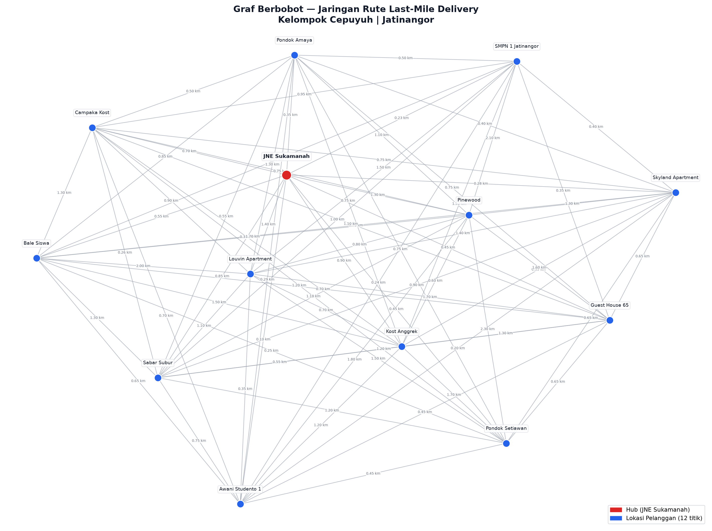
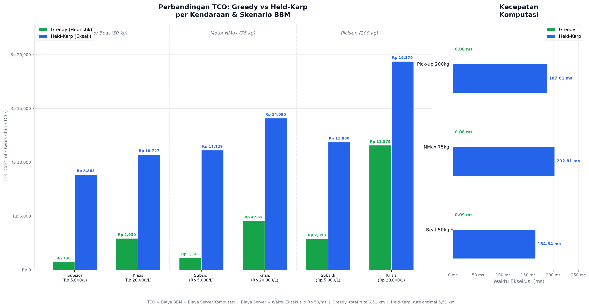

# Logistics Route Optimization: Heuristic vs Exact Algorithm Simulation

Repositori ini berisi simulasi komparasi arsitektur algoritma pencarian rute (*Last-Mile Delivery*) untuk menentukan keputusan bisnis terkait infrastruktur teknologi perusahaan ekspedisi. Kami membandingkan algoritma **Greedy dengan Backtracking (Heuristik)** dan **Dynamic Programming Held-Karp (Eksak)** berdasarkan *Total Cost of Ownership* (TCO) yang mencakup biaya komputasi server awan dan biaya operasional bahan bakar minyak (BBM) dinamis.

---

## Tim Pengembang
* **Sammy Farrel Zebua (140810240016)** — *Data & Integration Engineer* (Pemodelan Matriks & Ekstraksi Data Gmaps)
* **Tristan Bonardo Silalahi (140810240058)** — *Logic & Heuristic Engineer* (Implementasi Greedy & Fungsi Biaya Dinamis)
* **Laudzan Ananda Syawaliandi (140810240050)** — *Optimization Engineer* (Implementasi DP Held-Karp & Integrasi CLI)
* **Vincentius Raynard Thedy (140810240028)** — *QA, Analyst & Git Manager* (Analisis Kompleksitas, Metrik Finansial, & Dokumentasi)

---

## 1. Timeline Pengerjaan Proyek

Berikut adalah alur waktu pengerjaan proyek oleh tim kami:

| Tanggal | Target Pekerjaan |
| :--- | :--- |
| **Selasa, 16 Juni 2026** | <ul><li>`README.md` (Pemilihan Algoritma & Struktur Repo)</li></ul> |
| **Rabu, 17 Juni 2026** | <ul><li>Pemodelan data (Format CSV terpisah untuk matriks jarak dan beban paket)</li><li>Implementasi Algoritma Heuristik dan Eksak</li></ul> |
| **Kamis, 18 Juni 2026** | <ul><li>Menggabungkan semua pekerjaan (Algoritma Heuristik dan Eksak)</li></ul> |
| **Jumat, 19 Juni 2026** | <ul><li>*Finishing* dan Finalisasi Proyek</li></ul> |

## 2. Visualisasi Graf Berbobot

Berikut adalah representasi visual dari struktur data **Graf Berbobot** (Adjacency Matrix) yang menjadi fondasi simulasi ini. Setiap titik biru adalah lokasi pelanggan, titik merah adalah Hub, dan setiap garis adalah jalur dengan bobot jarak dalam kilometer.



## 3. Cara Menjalankan Program

Pastikan sistem Anda menggunakan minimal **Python 3.8**. Dataset (*nodes*, beban paket, dan matriks jarak) akan dibaca secara otomatis dari direktori `data/` dalam format `.csv`. Tidak diperlukan instalasi *library* eksternal apapun.

**Jalankan program dari *root* repositori:**
```bash
python src/main.py
```

Program akan menampilkan menu interaktif di terminal:

```
=============================================
MENU SIMULASI OPTIMASI RUTE LOGISTIK
=============================================
Pilih Skenario BBM:
1. Skenario Subsidi  (Rp 5.000/liter)
2. Skenario Krisis   (Rp 20.000/liter)
3. Bandingkan Kedua Skenario
0. Keluar

Masukkan pilihan (1/2/3/0):

Pilih Paket:
1. Paket 50kg
2. Paket 75kg
3. Paket 200kg
```

> **Catatan:** Semua parameter (lokasi, bobot paket, harga BBM, skenario) dibaca dari file `.csv` di direktori `data/` dan **tidak ada nilai yang di-hardcode** di dalam logika program utama.

## 4. Pemilihan Algoritma & Trade-Off

Dalam simulasi ini, kami memilih dua pendekatan algoritma yang bertolak belakang untuk memperlihatkan *trade-off* antara kecepatan eksekusi komputasi dan optimalitas jarak rute:

### A. Algoritma Heuristik (Greedy + Backtracking)
Kami mengimplementasikan algoritma **Greedy** yang diperkuat dengan mekanisme *backtracking*. Pada setiap *node*, algoritma memilih lokasi pelanggan terdekat yang belum dikunjungi. Jika algoritma menemui jalan buntu (*dead-end*) karena tidak ada jalur langsung ke node berikutnya, mekanisme *backtracking* akan mundur dan mencoba kandidat terdekat berikutnya hingga rute lengkap ditemukan.

*   **Kelebihan:** Sangat ringan dan cepat. Biaya *Cloud Server* (berbasis eksekusi per milidetik) hampir mendekati nol, terbukti di bawah **Rp 100** untuk semua skenario.
*   **Trade-off:** Berpotensi terjebak dalam *local optimum*. Hasil rute akhir bisa sub-optimal karena tidak mempertimbangkan konsekuensi jarak jangka panjang dari setiap pilihan.

### B. Algoritma Eksak (Dynamic Programming - Held-Karp)
Sebagai algoritma penentu rute absolut, kami mengimplementasikan **DP Held-Karp** dengan *Memoization*. Algoritma ini memecah masalah TSP menjadi sub-masalah dengan mengingat jarak minimum untuk setiap *subset node* yang sudah dikunjungi menggunakan representasi *bitmask*.

*   **Kelebihan:** Dijamin 100% menghasilkan rute paling efisien secara matematis dan menekan pengeluaran BBM semaksimal mungkin.
*   **Trade-off:** Sangat boros *resource* komputasi. Waktu eksekusinya bertumbuh secara eksponensial seiring bertambahnya *node* pelanggan (~127 ms pada 12 node), yang memicu lonjakan tagihan *Cloud Server Pay-as-you-go* hingga **Rp 6.300 – Rp 7.300** per satu kali pengiriman.

## 5. Analisis Kompleksitas (Big-O)

Berdasarkan penelusuran struktur rekursif dan iterasi *loop* pada *source code* utama kami, berikut adalah analisis teoritis untuk metrik ruang dan waktu:

*   **Greedy + Backtracking (Heuristik)**
    *   **Kompleksitas Waktu:** $O(n^2)$
        Pada setiap langkah dari $n$ total *node*, algoritma melakukan iterasi ke semua *node* yang belum dikunjungi untuk mencari yang terdekat. Mekanisme *backtracking* tidak mengubah kompleksitas asimtotik karena pada praktiknya jarang aktif di graf yang terhubung dengan baik.
    *   **Kompleksitas Ruang (Memori):** $O(n)$
        Hanya membutuhkan ruang ekstra untuk menyimpan set *node* yang belum dikunjungi dan *call stack* rekursi dengan kedalaman maksimal $n$.

*   **DP Held-Karp (Eksak)**
    *   **Kompleksitas Waktu:** $O(n^2 \cdot 2^n)$
        Algoritma mengevaluasi $2^n$ kemungkinan *subset node* (direpresentasikan sebagai *bitmask*). Untuk setiap kombinasi *subset*, program melakukan iterasi pada $n$ *node* sebagai kandidat langkah berikutnya. Meskipun jauh lebih optimal dari $O(n!)$ milik *Brute Force* murni, waktu eksekusinya tetap berada di ranah eksponensial.
    *   **Kompleksitas Ruang (Memori):** $O(n \cdot 2^n)$
        Penggunaan ruang sangat masif karena program bergantung pada *memoization table* yang menyimpan nilai jarak minimum untuk setiap kemungkinan status `(bitmask_dikunjungi, node_posisi_saat_ini)`.

## 6. Summary & Keputusan Bisnis

Berikut adalah grafik dan tabel hasil simulasi penuh pada seluruh kombinasi kendaraan, paket, dan skenario BBM:



| Kendaraan | Skenario | Waktu Greedy | TCO Greedy | Waktu HK | TCO Held-Karp | Pemenang |
|:---|:---|---:|---:|---:|---:|:---:|
| Beat (50 kg) | Subsidi — Rp 5.000/L | 0,09 ms | **Rp 736** | 164,84 ms | Rp 8.863 | ✅ Greedy |
| Beat (50 kg) | Krisis — Rp 20.000/L | 0,09 ms | **Rp 2.930** | 164,84 ms | Rp 10.727 | ✅ Greedy |
| NMax (75 kg) | Subsidi — Rp 5.000/L | 0,08 ms | **Rp 1.141** | 202,81 ms | Rp 11.129 | ✅ Greedy |
| NMax (75 kg) | Krisis — Rp 20.000/L | 0,08 ms | **Rp 4.552** | 202,81 ms | Rp 14.095 | ✅ Greedy |
| Pick-up (200 kg) | Subsidi — Rp 5.000/L | 0,08 ms | **Rp 2.898** | 187,61 ms | Rp 11.880 | ✅ Greedy |
| Pick-up (200 kg) | Krisis — Rp 20.000/L | 0,08 ms | **Rp 11.579** | 187,61 ms | Rp 19.379 | ✅ Greedy |

> *Greedy menghasilkan rute **6,51 km**, Held-Karp menghasilkan rute optimal **5,51 km** (selisih ~1 km / ~15%).*

### Kesimpulan Keputusan Bisnis

1.  **Skenario Subsidi (Rp 5.000/liter):** Algoritma **Greedy** adalah pilihan yang jauh lebih logis. Meski Held-Karp berhasil memangkas jarak rute sebesar ~15%, penghematan BBM yang dihasilkan hanya berkisar **Rp 92 – Rp 360** sehingga tidak mampu menutup *overhead* biaya *Cloud Server* Held-Karp yang mencapai **Rp 6.300 – Rp 7.300** per pengiriman.

2.  **Skenario Krisis (Rp 20.000/liter):** Algoritma **Greedy tetap menang** secara TCO. Bahkan di harga BBM tertinggi sekalipun, penghematan BBM Held-Karp hanya mencapai **Rp 370 – Rp 1.439**, masih jauh di bawah *overhead* server-nya.

### Titik Break-Even (BEP)

Dari analisis *Total Cost of Ownership*, implementasi Held-Karp baru akan menguntungkan secara finansial ketika:

$$P_{BEP} = \frac{\Delta \text{Biaya Server}}{\Delta \text{Konsumsi Liter}} = \frac{\text{Server}_{HK} - \text{Server}_{Greedy}}{\text{Liter}_{Greedy} - \text{Liter}_{HK}}$$

| Kendaraan | BEP Harga BBM |
|:---|---:|
| Beat (50 kg) | **Rp 338.344/liter** |
| NMax (75 kg) | **Rp 216.927/liter** |
| Pick-up (200 kg) | **Rp 88.380/liter** |

**Interpretasi:** Harga BBM di Indonesia (bahkan dalam kondisi krisis ekstrem sekalipun) tidak akan pernah mendekati nilai BEP tersebut. Kesimpulan finalnya: **untuk skala operasional rute pendek seperti *last-mile delivery* di area Jatinangor (~6 km, 12 titik), algoritma Greedy dengan Backtracking adalah pilihan arsitektur yang paling rasional secara finansial dalam kondisi ekonomi apapun.**

Held-Karp baru akan relevan dipertimbangkan apabila skala operasional membesar secara signifikan seperti misalnya, rute antar kota dengan puluhan node yang di mana selisih jarak yang dihasilkan menjadi puluhan hingga ratusan km, sehingga penghematan BBM-nya baru mampu mengkompensasi biaya komputasinya yang mahal.
